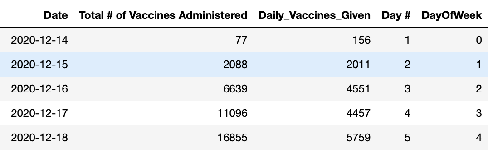
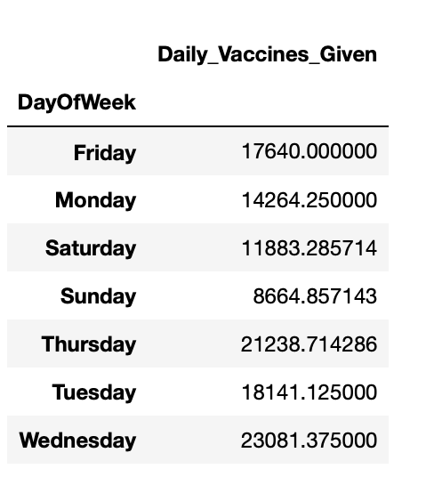
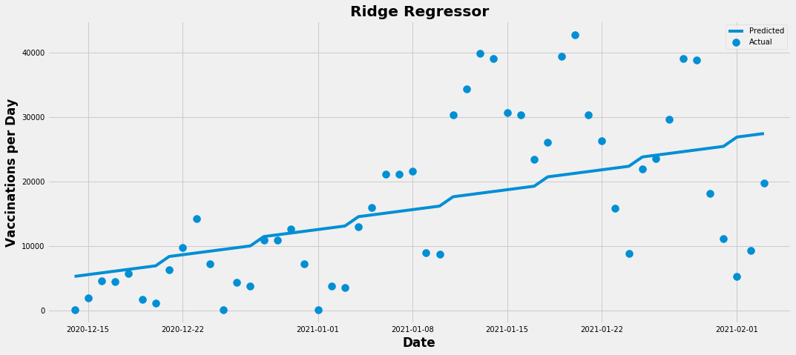
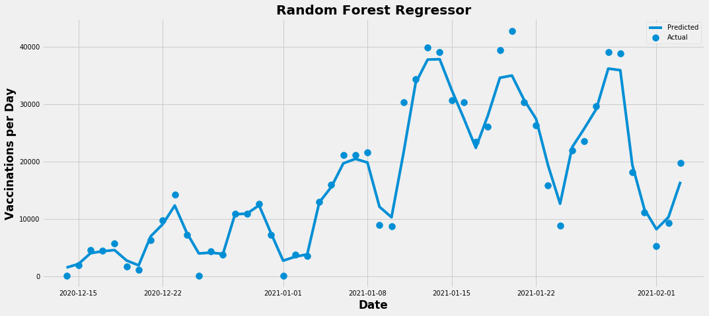

# NYC Herd Immunity Predictor
---
- Predicts when NYC might reach herd immunity during the COVID-19 pandemic. 
- Cleaned and manipulated data using panads and numpy. 
- Engineered features such as day of week in interger format to provide a better model fit. 
- Optimized Ridge and RandomForest regressors using GridSearchCV. 

## Code and Resources Used
---
- **Python Version:** 3.7
- **Packages:** sklearn, matplotlib, pandas, numpy, seaborn 
- **Data Source:** https://www1.nyc.gov/site/doh/covid/covid-19-data-vaccines.page

## Assumptions
---
- This model has been created before the authoriziation for use of single-dose vaccines. Therefore, the moddel assumes an individual needs two vaccines shots to reach "full immunity." This has been accounted for in the model by multiplying the population of NYC by two for simplicity's sake.
- The limit of NYC's vaccine distribution remains to a large degree, a mystery. However, Mayor DeBlasio has hinted at 300K vaccinations per week being a short term goal, and 500k vaccinations being the upper limit of the city given that Federal Government supply is sufficient. This model will assume vaccinations will ramp up slowly and then remain at these respective "limits." The model will use plot out trajectories of 300k, 400k and 500k vaccinations/week. 
- This model does not account for any natural immunity accquired, nor does it account for the spread of new, more contagious variants. These factors likely play a crucial role in dictating when herd immunity will be reached. 

## Data Cleaning/Wrangling and Feature Engineering
---
- Downloaded data as .csv format and loaded it into a Pandas DataFrame.
- Removed duplicates, NaNs and columns deemed irrelevant. 
- Created day of week feature in interger format as vaccinations tend to peak during the middle of the week and taper off towards the end.
- Created daily vaccine count feature. 
 
### Average Vaccinations for Each Day of the Week

## Model Building/Performance 
---
- Withheld 5% of the data as testing data in order to maximize the data used for training, as the original data only contains 1.5 months of data. 
- Optimized 'alpha' paramters on Ridge Regressor using GridSearchCV.
- Optimized 'n_estimators' and 'max_features' on Random Forest Regressor using GridSearchCV.
- Obtainted an R^2 score of .26 on the Ridge Regressor. The low score can be attributed to the sparse data available, however when graphed appears to be a better fit than the Random Forest Regressor.
- Obtainted an R^2 score of .84. While significantly higher than the Ridge Regressor score, the Random Forest is clearly overfitting. 

## Final Prediction 
---

